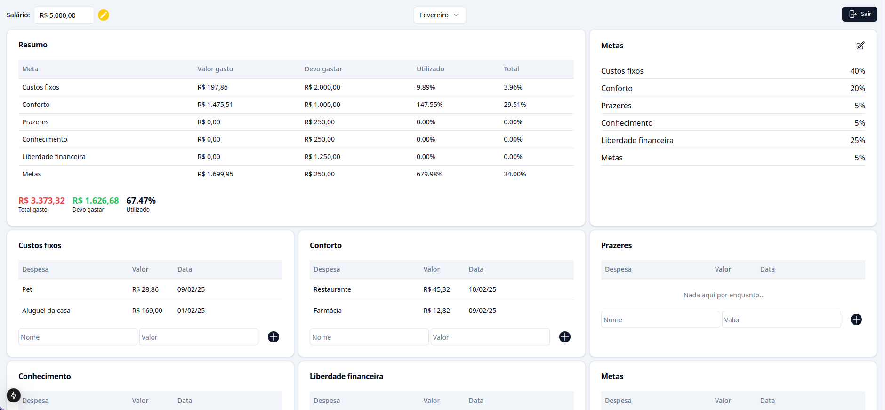

<h1 align="center">
  Fincon
</h1>

  Simplify your financial management!

## 🚀 About the Project

Fincon is a financial management tool inspired by the dashboard from [Raul Senna](https://www.youtube.com/@investidorsardinha), with some modifications. The main purpose of this project was to practice API development in **Go**, but it has evolved into a useful tool for organizing personal finances.

### 🌟 Key Points:

- Built to **practice API development** in **Go**.
- Hosted on **[Fly.io](https://fly.io/)**.
- Features are still being added—check the **[Issue Tracker](https://github.com/joaopsramos/fincon/issues)** for upcoming improvements.
- I primarily focus on backend development, so the frontend code may be minimal.

## 📌 Financial Management Tips

A detailed explanation of **how to organize your finances** is available in this [video](https://www.youtube.com/watch?v=oLMxWL2w5PY), but here’s a quick summary:

- **Fixed Costs:** Essential expenses like rent, car payments, electricity, water, etc.
- **Comfort:** Services like Netflix, Disney+, Uber—things that could be cheaper but are paid for convenience.
- **Pleasures:** Anything that makes you happy.
- **Goals:** Personal objectives, travel, experiences, etc.
- **Knowledge:** Investment in personal learning, such as books or courses.
- **Financial Freedom:** Financial investments, aiming for long-term returns.

## 🛠️ Technologies Used

- **Go** (Backend)
- **PostgreSQL** (Database)
- **Next.js** (Frontend)

## ⚠️ Disclaimer

I have **no affiliation with Raul Senna**. This project is completely **free and open-source**, created as a learning exercise for Go development.

## 📜 License

This project is licensed under the **MIT License** – see the [LICENSE](LICENSE.txt) file for details.

---

Made with ❤️ by João Ramos | **[Connect on LinkedIn](https://www.linkedin.com/in/eliasgcf/)**
